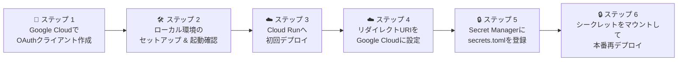

# Streamlit Google認証アプリ (Cloud Run デプロイ)

Google Cloud (Cloud Run) 上で動く、Google認証（OAuth 2.0）を備えた Streamlit アプリケーションの構築・デプロイ手順です。
## 📊 全体の流れ（デプロイまでのステップ）

## 📁 ディレクトリ構成

```text
streamlit_gcp_dbt/
├── .streamlit/
│   └── secrets.toml  # ローカル実行用の認証情報（※Git非推奨）
├── .gcloudignore     # Cloud Runへ不要なファイルを送らないための除外設定
├── app.py            # アプリケーション本体
├── Dockerfile        # コンテナのビルド定義
├── requirements.txt  # 依存パッケージ
└── README.md         # 構築・デプロイ手順書
```

---

## 🔑 ステップ 1: Google Cloud Console で OAuth クライアントを作成する

1. **Google Cloud Console** にアクセスし、プロジェクトを選択します。
2. 左メニューの **「APIとサービス」** > **「OAuth 同意画面」** から同意画面を設定します。
3. 左メニューの 「対象」 （またはオーディエンス画面）を開き、「テストユーザー」 セクションの 「+ Add users」 ボタンをクリックして、アプリにログインさせたい自分のGoogleメールアドレスを追加します。
4. 左メニューの **「クライアント」** から **「クライアントを作成」** を選択します。
   * **アプリケーションの種類**: `ウェブ アプリケーション`
   * **承認済みリダイレクト URI**: 後でCloud RunのURLが決まってから正確なものを設定しますが、まずはテスト用に `http://localhost:8501/oauth2callback` などを登録しておきます。
4. 作成完了後、表示される **「クライアント ID」** と **「クライアント シークレット」** をメモします。

---

## 🛠️ ステップ 2: ローカル開発環境のセットアップ

### 2-1. 仮想環境の作成と有効化
ターミナル（PowerShell等）でプロジェクトフォルダに移動し、仮想環境を作成して有効化します。

```bash
python -m venv .venv
.\.venv\Scripts\Activate.ps1  # Windows (PowerShellの場合)
```

### 2-2. パッケージのインストール
`requirements.txt` に記載されている依存パッケージをインストールします。

```bash
pip install -r requirements.txt
```

### 2-3. シークレット設定 (`secrets.toml`)
プロジェクトフォルダ内に `.streamlit` フォルダを作成し、その中に `secrets.toml` を配置します。

```toml
[auth]
redirect_uri = "http://localhost:8501/oauth2callback"
cookie_secret = "任意のランダムな文字列"
client_id = "ステップ1で取得したクライアントID"
client_secret = "ステップ1で取得したクライアントシークレット"
server_metadata_url = "https://accounts.google.com/.well-known/openid-configuration"
```

### 2-4. ローカルでのアプリ起動
以下のコマンドを実行し、ブラウザで動作確認を行います。

```bash
streamlit run app.py
```

---

## ☁️ ステップ 3: Google Cloud (Cloud Run) へのデプロイ

### 初回デプロイ
ソースコードから直接Cloud Runへビルド・デプロイを行います（未認証アクセスを許可）。

```bash
gcloud run deploy my-streamlit-app --source . --region asia-northeast1 --allow-unauthenticated
```
*初回実行時やサービス作成時はリージョンやアクセス権限の指定が必要です。*

## ☁️ ステップ 4: リダイレクト URI の更新
1. 発行されたCloud RunのURLをもとに、正しいリダイレクトURIを確定させます。
   * 例: https://my-streamlit-app-xxxxx-an.a.run.app/oauth2callback

2. Google Cloud Console の OAuth クライアント設定に戻り、「承認済みリダイレクト URI」に上記のURLを追加・保存します

## 🔒 ステップ 5: Secret Manager に `secrets.toml` の中身を登録する

1. Google Cloud Console の検索窓で **「Secret Manager」** と検索して開きます。
2. **「シークレットを作成」** をクリックします。
3. 名前（例: `streamlit-secrets`）を入力します。
4. 「シークレットの値」の欄に、ローカルの `secrets.toml` の内容を貼り付けます。

   > ⚠️ **【重要】`redirect_uri` の書き換えにご注意ください！**
   > ローカル用（`http://localhost:8501/...`）のままだと本番環境でログインエラーになります。必ず**発行された実際のCloud RunのURL**に書き換えてください。

    ```toml
    [auth]
    redirect_uri = "発行された実際のCloud RunのURL/oauth2callback"  # ← ★ここに実際のCloud RunのURLを入力！
    cookie_secret = "ランダムな文字列"
    client_id = "Google Cloudで取得したクライアントID"
    client_secret = "Google Cloudで取得したクライアントシークレット"
    server_metadata_url = "[https://accounts.google.com/.well-known/openid-configuration](https://accounts.google.com/.well-known/openid-configuration)"
    ```

5. **「シークレットを作成」** をクリックします。

---

## 🔒 ステップ 6: Cloud Run にシークレットをマウントして本番稼働させる

1. **Google Cloud Console** の Cloud Run 画面を開き、対象のサービス（例: `my-streamlit-app`）を選択します。
2. 画面上部にある **「コンテナ」** タブをクリックします。
3. 画面を下にスクロールし、右下あたりにある **「ボリューム」** セクションの **「+ ボリュームをマウント」** をクリックします。
4. 表示されたポップアップ（新しいボリュームの作成）の中から、**「シークレット（Secret をボリュームとしてマウントします）」** を選択します。
5. シークレットの設定画面で以下のように指定します：
   * **シークレット**: 先ほど作成したシークレット（例: `streamlit-secrets`）を選択
   * **マウントパス / パス**: `/app/.streamlit/secrets.toml` （※ファイルとして正しく配置されるようにパスを指定します）
6. 設定を完了したら、画面右上（または下部）にある **「再デプロイ」** ボタンをクリックしてサービスを更新します。

これで、Cloud Run上のStreamlitアプリが安全にSecret Managerの認証情報を読み込めるようになり、本番環境でのGoogle認証が完全に機能するようになります！

## 2回目以降の再デプロイ
一度サービスが作成された後は、以下のシンプルなコマンドだけで最新のコードを反映できます。

```bash
gcloud run deploy my-streamlit-app --source .
```
*(※ `--region` や `--allow-unauthenticated` などの設定はCloud Run側に自動で引き継がれます)*